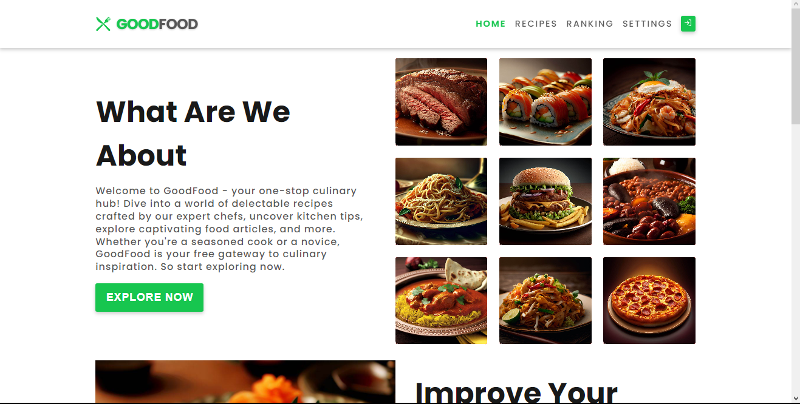
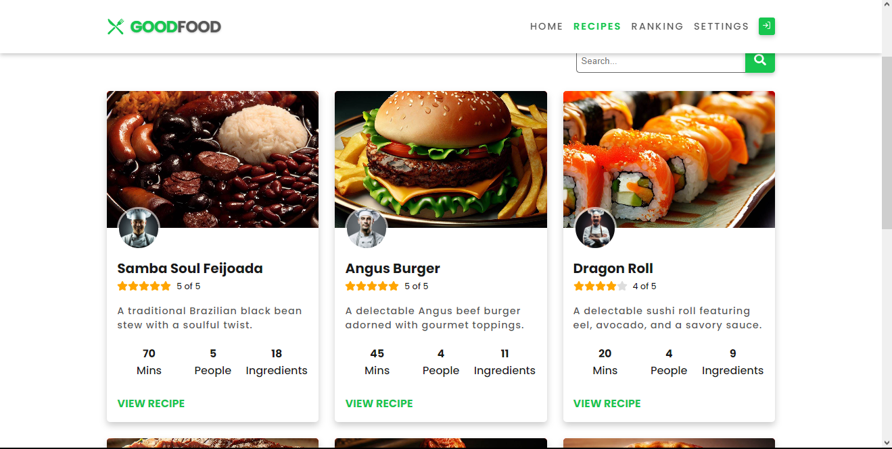
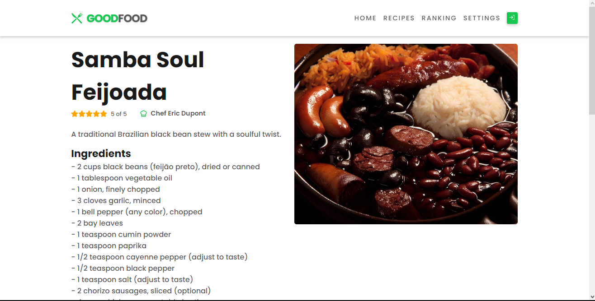
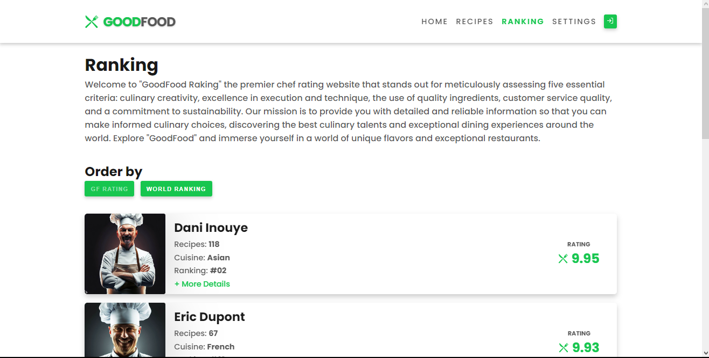
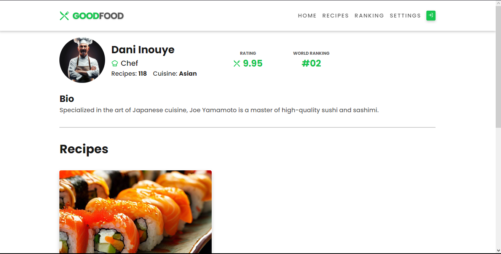
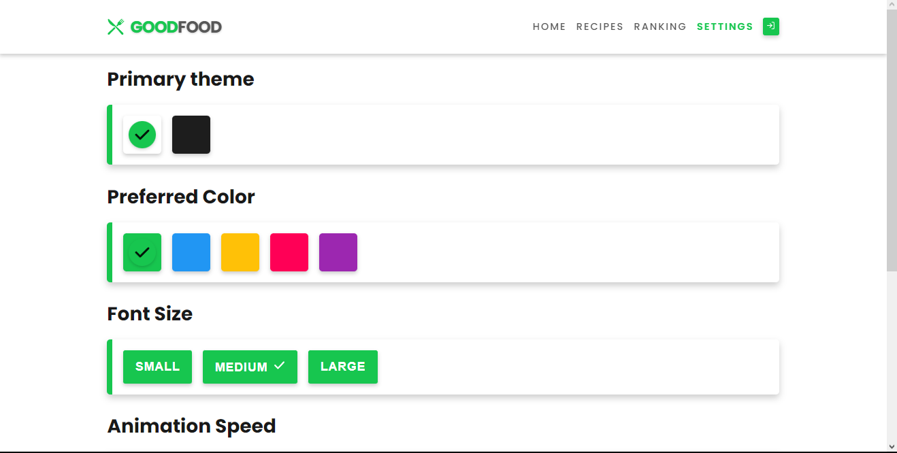

# GoodFood - Responsive React Website


Welcome to GoodFood, a responsive React website project developed as part of a presentation for a company interested in enhancing their recipe website. This project was created to showcase ideas and functionalities for the company's website and features a fictitious recipe portal with four main pages: Home, Recipes, Ranking, and Settings.

## Project Overview

GoodFood is a fictitious recipe portal that offers several features for users, including:

- **Home**: A homepage that provides information about the company/brand and showcases the top chefs on the platform.

- **Recipes**: A page that lists all available recipes in card format. Each card displays the dish name, an image of the dish, the chef's name, a rating (using a star-rating system), and a link to access the complete recipe.

- **Ranking**: A page that displays chefs ranked in two ways: by "GF Rating" (GoodFood Rating) and by "Worldwide Ranking." Users can sort the list using both criteria.

- **Settings**: A page where users can personalize four aspects of the site:
  - Primary Theme: Choose a color palette for the main theme of the site.
  - Favorite Color: Select your favorite color to highlight elements on the site.
  - Font Size: Adjust the font size for improved readability.
  - Animation Speed: Configure the speed of animations on the site.

The project uses React for the user interface, React Router for managing routes, simulates a database with JSON files to store recipe and chef information, and includes a logo and color palette created solely for demonstration purposes and not intended for the final client.

## Technologies Used

- **React**: The primary library for user interface development.
- **React Router**: Used for route management in the application.
- **JSON**: Utilized to simulate a database and store recipe and chef information.
- **CSS**: Styling for pages and components.

## How to Run the Project

To run this project on your local machine, follow these steps:

1. Clone this repository:

   ```bash
   git clone https://github.com/jorgeprj/goodfood-react.git
   ```

2. Navigate to the project directory:

   ```bash
   cd goodfood-react
   ```

3. Install dependencies:

   ```bash
   npm install
   ```

4. Start the development server:

   ```bash
   npm run dev
   ```

5. Open your web browser and access the project at `http://localhost:5173`.

## Accessing the Website

You can access the GoodFood website by clicking [here](https://jorgeprj.github.io/goodfood-react).

## Screenshots













## Contribution

If you wish to contribute to this project, feel free to open issues or submit pull requests. We welcome improvements and suggestions.

## Author

This project was developed by [Jorgeprj](https://github.com/jorgeprj).

---

Thank you for checking out the GoodFood project! We hope it serves as a valuable demonstration of ideas for your company's website. If you have any questions or need further information, please don't hesitate to contact us.

**Enjoy your culinary experience with GoodFood!** 🍽️👩‍🍳👨‍🍳